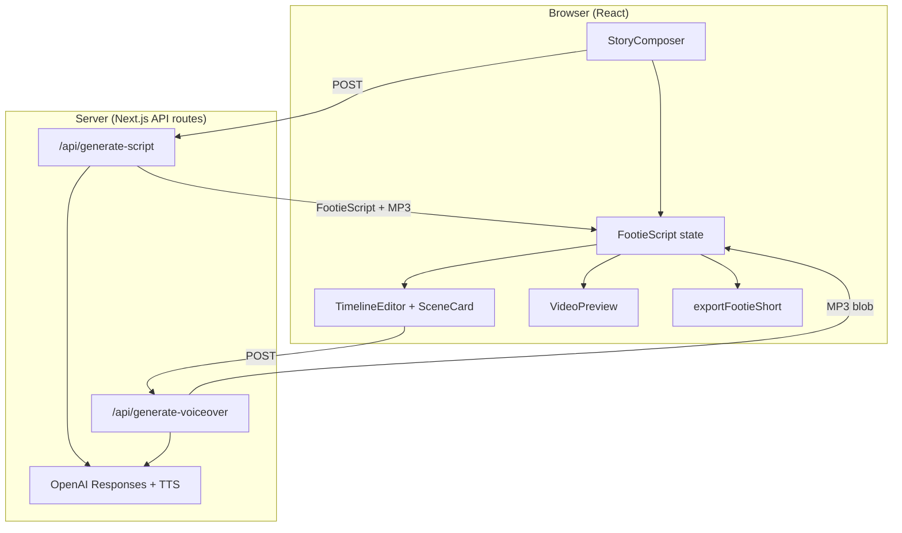
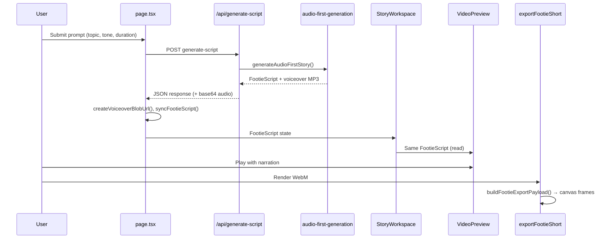
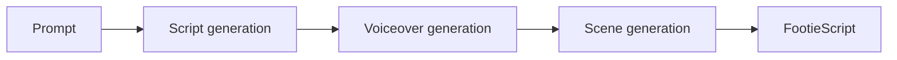
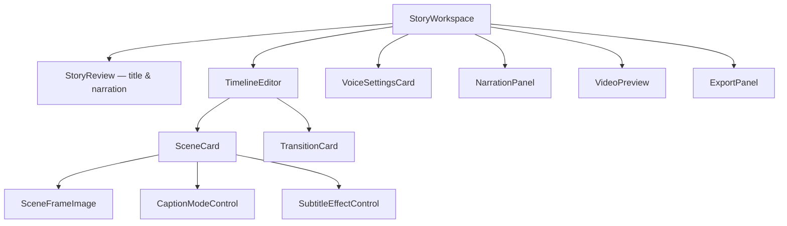
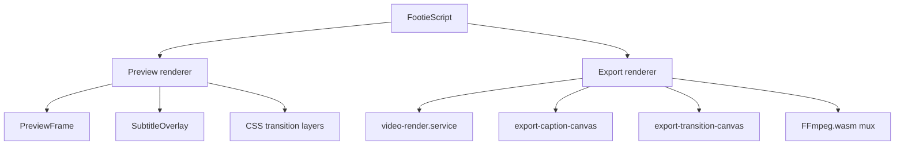

# Architecture

FootieBitz is a single-page Next.js studio for creating vertical football documentary shorts. The application is organized into three major layers — **Generation**, **Editing**, and **Rendering** — that operate on a shared in-memory story model (`FootieScript`).

AI work runs on server API routes. All editing, preview, and export run in the browser. There is no database; story state lives in React until the page is refreshed.

---

## System overview



---

## Current data flow

The end-to-end path from user input to downloaded video:

```
Prompt
  ↓
Story
  ↓
Voiceover
  ↓
Editor
  ↓
Preview
  ↓
Export
```

### Step-by-step

| Stage | What happens | Key code |
|-------|--------------|----------|
| **Prompt** | User enters topic, tone, duration, scene count, quality mode in `StoryComposer` | `src/components/StoryComposer.tsx`, `src/app/page.tsx` |
| **Story** | Server generates title + continuous narration via OpenAI | `script-generation.service.ts`, `lib/ai/prompts.ts` |
| **Voiceover** | Server synthesizes MP3 from narration; duration measured from audio | `voiceover.service.ts` |
| **Story (scenes)** | Server plans timed scenes fitted to voiceover length | `scene-planning.service.ts`, `audio-first-generation.service.ts` |
| **Editor** | Client receives `FootieScript`; user edits scenes, images, captions, transitions | `StoryWorkspace`, `TimelineEditor`, `lib/voiceover.ts` |
| **Preview** | React playback with narration-synced clock | `VideoPreview`, `PreviewFrame`, `usePreviewPlayback` |
| **Export** | Canvas frame loop + optional FFmpeg.wasm audio mux | `video-render.service.ts`, `ffmpeg.utils.ts` |



After generation, every consumer reads the same `FootieScript` object held in `page.tsx` React state. Updates flow through `applyStoryUpdate()` → `syncFootieScript()` before reaching preview and export.

---

## Layer 1 — Generation

Generation turns a football topic into a timed, narrated story. It runs **server-side only** (`server-only` services) and is orchestrated by the audio-first pipeline.

**Entry point:** `POST /api/generate-script` (`src/app/api/generate-script/route.ts`)  
**Orchestrator:** `generateAudioFirstStory()` (`src/features/story/services/audio-first-generation.service.ts`)



### Prompt

The user's brief is assembled from UI inputs and passed to AI prompt builders.

| Input | Source |
|-------|--------|
| Topic | `StoryComposer` textarea |
| Tone | `dramatic` \| `funny` \| `tactical` \| `news` \| `emotional` |
| Duration | 15–60 seconds |
| Scene count | 3–12 |
| Quality mode | `cheap` \| `balanced` \| `best` → OpenAI model |

**Prompt templates:** `src/lib/ai/prompts.ts`

- `buildFootieScriptPrompt()` — documentary narration instructions, tone guidance, JSON shape example
- `buildScenePlanPrompt()` — scene breakdown from script + measured audio duration

**Model selection:** `src/lib/ai/script-models.ts` (`gpt-4.1-mini` for cheap, `gpt-4.1` for balanced/best; overridable via `OPENAI_SCRIPT_MODEL`)

### Script generation

Produces a **`StoryScript`**: title + one continuous narration block (not disconnected captions).

| File | Role |
|------|------|
| `services/script-generation.service.ts` | Calls OpenAI Responses API |
| `services/story-parse.service.ts` | JSON extraction and validation |
| `lib/ai/script-schema.ts` | Structured output schema |
| `lib/ai/openai.client.ts` | OpenAI client singleton |

Output type: `StoryScript` in `src/features/story/types/audio-first.types.ts`.

### Voiceover generation

Converts narration text to MP3 and resolves duration for scene timing.

| File | Role |
|------|------|
| `services/voiceover.service.ts` | `generateVoiceoverFromScript()`, `generateVoiceoverMp3()` |
| `utils/voiceover-duration.utils.ts` | Speed-adjusted duration math |
| `lib/audio/mp3-duration.utils.ts` | MP3 length measurement |

- Model: OpenAI `tts-1`
- Default voice: `alloy` (see `lib/voiceoverOptions.ts`)
- Speed presets applied at TTS or adjusted post-generation
- Duration source: measured from MP3, or estimated from word count as fallback

Standalone regeneration: `POST /api/generate-voiceover` — used when the user edits narration or voice settings after initial generation.

### Scene generation

Plans `FootieScene[]` timed to the measured voiceover duration.

| File | Role |
|------|------|
| `services/scene-planning.service.ts` | AI scene plan from script + `voiceoverDurationMs` |
| `utils/audio-first.utils.ts` | Fit scenes to target duration |
| `utils/timeline.utils.ts` | `ensureTimelineItems()`, default transitions |

Each scene receives:

- `subtitle` — AI-generated on-screen caption
- `sceneType` — optional `intro` \| `context` \| `match` \| `transition` \| `ending`
- `narration` — excerpt of full narration for that scene window
- Timings — `attachEvenVoiceoverTiming()` distributes ms across scenes

Final assembly: `syncFootieScript()` normalizes the result into `FootieScript` with `timelineItems`.

### Fallback

If audio-first fails, `/api/generate-script` falls back to legacy `generateFootieScript()` (single JSON call with embedded scenes) and optionally applies voiceover timing via `applyAudioFirstTiming()`.

---

## Layer 2 — Editing

Editing is entirely **client-side**. The production timeline mutates `FootieScript` in React state; changes are immediately visible in preview.

**Shell:** `src/components/StoryWorkspace.tsx`  
**Timeline:** `src/features/editor/components/TimelineEditor.tsx`  
**State helpers:** `src/lib/voiceover.ts` (`syncFootieScript`, `applyStoryUpdate`, `applySceneUpdate`)



### Scene editor

`TimelineEditor` manages the ordered list of scenes and transition cards.

| Operation | Utility |
|-----------|---------|
| Add / delete / duplicate | `timeline.utils.ts` |
| Move up / down | Reorder + `recalculateSceneTimings()` |
| Add buffer scene | Quick-insert typed placeholder (Intro, Context, etc.) |
| Add transition | Insert `TransitionTimelineItem` after selected scene |

Each scene is rendered as a **`SceneCard`** with duration control, caption mode, image controls, and type selector.

### Image upload

- **`MediaPicker`** — file input → `blob:` URL
- Stored on scene as `SceneImage.url` (legacy `uploadedImage` strings migrate on sync)
- **`sceneHasImage()`** / **`getSceneImageUrl()`** — read helpers in `scene.utils.ts`

### Image positioning

Pan position stored as normalized `x`, `y` offsets on `SceneImage`.

- Editor: **`SceneFrameImage`** — drag on desktop and touch
- Patches via `applySceneImageSettings()` in `lib/voiceover.ts`
- Draw: **`drawSceneImageInFrame()`** in `scene.utils.ts` (shared by preview and export)

### Fit / Fill

`SceneImage.fitMode`:

| Mode | Behavior |
|------|----------|
| `fit` | Full image visible inside 9:16 frame (letterbox) |
| `fill` | Image covers frame (may crop) |

Control: **`SceneImageZoomControl`** in `SceneCard`.

### Zoom

Manual zoom multiplier on `SceneImage.scale`. Combined at render time with image motion scale (see below).

### Caption modes

Per-scene `captionMode` (`src/features/story/utils/caption.utils.ts`):

| Mode | On-screen source |
|------|------------------|
| `generated` (default) | AI scene `subtitle` — static for full scene |
| `subtitles` | `subtitleText` split into timed chunks from narration |

Toggle: **`CaptionModeControl`**.

### Subtitle editing

In subtitles mode:

- User edits `subtitleText` on the scene card
- **`splitSubtitleChunks()`** (`subtitle.utils.ts`) breaks text into phrase chunks (max ~5 words / 34 chars)
- Chunks timed evenly across scene duration
- Effects: **`SubtitleEffectControl`** — `fade-up`, `typewriter`, `highlight`
- Preview rendering: **`subtitleEffectPreview.tsx`**, **`SubtitleOverlay.tsx`**
- Max 3 visible lines, 90% frame width (`SUBTITLE_MAX_VISIBLE_LINES`, `SUBTITLE_MAX_WIDTH_RATIO`)

### Voice settings

Story-level `FootieScript.voiceSettings`:

- Voice — OpenAI TTS voice id
- Speed — 0.75x to 1.4x presets

UI: **`VoiceSettingsCard`**. Regeneration: **`NarrationPanel`** → `/api/generate-voiceover`.

### Scene duration editing

- Range: 1–20 seconds per scene
- Sets `durationSource: "manual"` via `applyManualDurationPatch()`
- **`recalculateSceneTimings()`** updates cumulative `startMs` / `endMs` for all scenes
- Story `totalDuration` = sum of scene durations

Manual edits change visual pacing only; the voiceover MP3 is not re-stretched unless the user regenerates narration.

### Transitions

Transition cards (`TransitionTimelineItem`) sit between scenes in `timelineItems`. They are editor metadata — not AI-generated.

| Property | Description |
|----------|-------------|
| `effect` | `cut`, `fade`, `slide-left`, `slide-right`, `zoom-in`, `zoom-out`, `blur` |
| `durationMs` | Overlay length, capped at 40% of outgoing scene |

UI: **`TransitionCard`**. Logic: **`transition-overlay.utils.ts`**.

**Model:** Transitions render as a **tail overlay** on the outgoing scene only. They do not extend total timeline duration. Captions hide during the overlay window.

### Image Motion (Ken Burns)

Optional slow zoom during scene playback, on top of manual pan/zoom.

| Field | Values |
|-------|--------|
| `imageMotion.type` | `none`, `zoom-in`, `zoom-out` |
| `imageMotion.intensity` | `subtle` (→1.05×), `medium` (→1.10×), `strong` (→1.16×) |

- Math: **`scene-image-motion.utils.ts`** — `resolveSceneImageMotionProgress()`, `resolveSceneImageMotionScale()`
- UI: **`SceneImageMotionControl`** inside `SceneImageZoomControl`
- Progress is linear from scene start (0) to scene end (1)

---

## Layer 3 — Rendering

Rendering turns `FootieScript` into visible frames. Two renderers exist — **Preview** (React/CSS) and **Export** (Canvas 2D) — sharing the same timing and layout utilities from `src/features/story/utils/`.



### Preview renderer

**Component tree:** `VideoPreview` → `PreviewFrame` → `SceneFrameImage` / placeholders

| File | Role |
|------|------|
| `preview/components/VideoPreview.tsx` | Playback controls, device frame, audio element |
| `preview/components/PreviewFrame.tsx` | Composites background + image + transition layers |
| `preview/hooks/usePreviewPlayback.ts` | Play/pause, clock, scene index |
| `preview/utils/previewTimeline.ts` | `getPreviewFrameAtTime()` — active scene at elapsed sec |
| `preview/utils/previewSceneTiming.ts` | Scene-local elapsed ms for selected scene |

Frame composition order:

1. Scene background (image or type-coloured placeholder)
2. Image motion scale on `SceneFrameImage`
3. Transition overlay (dual CSS layers via `getTransitionLayerStyles()`)
4. Captions (hidden during transition overlay)

Aspect ratio: **9:16** inside a phone-style device frame.

### Export renderer

**Entry:** `exportFootieShort()` in `src/features/export/services/video-render.service.ts`

Pipeline:

1. **`buildFootieExportPayload()`** — normalize to `ExportScene[]` (`export-payload.service.ts`)
2. Preload scene images
3. Create offscreen canvas at chosen resolution (720p–4K)
4. **`MediaRecorder`** on `canvas.captureStream(30 fps)` → WebM
5. Per-frame: clear → draw scene → draw transition → draw captions
6. Optional: **`ffmpeg.utils.ts`** muxes narration MP3 into final WebM

Quality presets: `export-quality.utils.ts` (720p, 1080p, 1440p, 4K vertical @ 30 fps).

### Subtitle renderer

Two caption paths, both in **`export-caption-canvas.utils.ts`**:

| Mode | Function | Behavior |
|------|----------|----------|
| Generated | `drawExportGeneratedCaption()` | Static wrapped text for scene duration |
| Subtitles | `drawExportSubtitlesCaption()` | Active chunk + effect animation per frame |

Subtitle display resolution: **`export-subtitle.utils.ts`** → `resolveExportSubtitleDisplay()` picks active chunk and effect progress from scene elapsed ms.

Export pill styling: content-sized rounded rectangle, `rgba(0,0,0,0.45)`, white text, bottom-centred at `subtitleY = height - 320 × scale`.

Preview equivalent: **`SubtitleOverlay.tsx`** + **`subtitleEffectPreview.tsx`** (CSS pill at `bottom: 8%`).

Shared chunk/progress math:

- Preview: `getActiveSubtitleChunkState()` (`subtitle-timing.utils.ts`)
- Export: `resolveExportSubtitleDisplay()` — must stay aligned (guarded by `test:export-subtitle-qa`)

### Voice synchronization

During preview playback with narration:

- **`usePreviewPlayback`** drives global elapsed time from the `<audio>` element when `playbackMode === "narration"`
- Visual scene index derived from global ms via `getSceneTimingAtGlobalTime()`
- Narration plays as one continuous track; scene boundaries are visual only
- Scene-local subtitle chunk progress uses `sceneElapsedMs / sceneDurationMs`

Export:

- Video frames timed by story duration (sum of scene ms)
- Narration muxed via FFmpeg.wasm; audio length may differ slightly from visual total if durations were manually edited after generation

### Transition renderer

Shared resolver: **`resolveSceneTransitionOverlay()`** in `transition-overlay.utils.ts`

| Renderer | Implementation |
|----------|------------------|
| Preview | CSS transforms/opacity on dual layers in `PreviewFrame` |
| Export | `drawExportTransitionBackgrounds()` in `export-transition-canvas.utils.ts` |

Overlay window: final N ms of outgoing scene (`clampOverlayTransitionDurationMs()`). Progress 0→1 across that window. Captions suppressed while overlay is active.

---

## Folder structure

```
footiebitz/src/
├── app/
│   ├── page.tsx                      # Studio root — FootieScript state
│   ├── layout.tsx
│   └── api/
│       ├── generate-script/route.ts  # Audio-first generation
│       └── generate-voiceover/route.ts
│
├── components/                       # Studio shell (not feature-specific)
│   ├── StoryComposer.tsx             # Prompt UI
│   ├── StoryWorkspace.tsx            # Post-generation layout
│   ├── StoryReview.tsx
│   ├── NarrationPanel.tsx
│   ├── ExportPanel.tsx
│   └── VoiceSettingsCard.tsx
│
├── features/
│   ├── story/                        # Domain model + generation + shared utils
│   │   ├── types/                    # FootieScript, FootieScene, TimelineItem
│   │   ├── services/                 # AI pipelines (server-only)
│   │   └── utils/                    # Timing, subtitles, images, transitions
│   │
│   ├── editor/                       # Layer 2 — timeline UI
│   │   └── components/
│   │       ├── TimelineEditor.tsx
│   │       ├── SceneCard.tsx
│   │       ├── SceneFrameImage.tsx
│   │       ├── TransitionCard.tsx
│   │       └── …controls
│   │
│   ├── preview/                      # Layer 3 — preview renderer
│   │   ├── components/
│   │   ├── hooks/
│   │   └── utils/
│   │
│   └── export/                       # Layer 3 — export renderer
│       ├── services/
│       │   ├── video-render.service.ts
│       │   └── export-payload.service.ts
│       └── utils/
│           ├── export-caption-canvas.utils.ts
│           ├── export-transition-canvas.utils.ts
│           └── ffmpeg.utils.ts
│
├── lib/
│   ├── ai/                           # Prompts, schema, OpenAI client
│   ├── voiceover.ts                  # syncFootieScript, applyStoryUpdate
│   └── generateScriptStream.ts       # NDJSON streaming client
│
├── hooks/                            # useFrameSize, useDragScrollLock, …
└── types/
    └── footiebitz.ts                 # API request/response types
```

---

## Server vs client boundary

| Concern | Location |
|---------|----------|
| OpenAI API calls | Server (`features/story/services/`, marked `server-only`) |
| `OPENAI_API_KEY` | Server environment only |
| `FootieScript` state | Client React state (`page.tsx`) |
| Image blob URLs | Client (file upload) |
| Preview rendering | Client React |
| Export rendering | Client Canvas + MediaRecorder |
| FFmpeg.wasm | Client (dynamic import) |

---

## Shared logic between preview and export

Preview and export intentionally call the same pure functions so visual output stays aligned:

| Concern | Shared utility |
|---------|----------------|
| Global → scene timing | `getSceneTimingAtGlobalTime()` |
| Scene duration | `getSceneDurationMs()` |
| Subtitle chunks | `splitSubtitleChunks()`, chunk progress math |
| Transitions | `resolveSceneTransitionOverlay()` |
| Image draw | `drawSceneImageInFrame()`, `resolveSceneImageMotionScale()` |
| Caption mode | `normalizeCaptionMode()` |

Regression tests in `src/lib/*.verify.ts` enforce parity (e.g. `test:export-subtitle-qa`, `test:transition-qa`, `test:timing-subtitle-qa`).

---

## Related documentation

| Document | Contents |
|----------|----------|
| [GENERATION.md](./GENERATION.md) | AI pipeline details |
| [EDITING.md](./EDITING.md) | Editor feature reference |
| [RENDERING.md](./RENDERING.md) | Canvas and FFmpeg internals |
| [DATA_MODEL.md](./DATA_MODEL.md) | Type definitions |
| [FEATURES.md](./FEATURES.md) | Implemented capability list |
