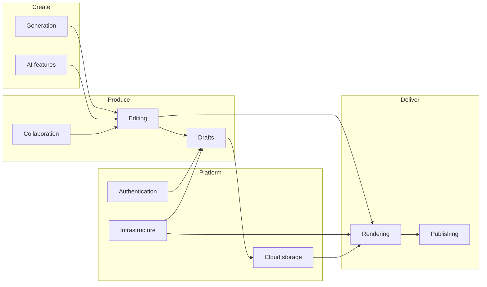

# Future Vision

Long-term product direction for ShortForge Studio. This document describes **where the product is going** — not how to build it.

ShortForge Studio today is a browser studio that turns a football topic into a narrated vertical short. The vision is to become the default **story-first short-form production tool** for football creators — from solo TikTok editors to club media teams.

For near-term phased delivery, see [ROADMAP.md](../ROADMAP.md). For what exists today, see [FEATURES.md](./FEATURES.md).

---

## North star

> **Start with the story. Everything else follows.**

Creators should spend their time on ideas, pacing, and visuals — not fighting tools. ShortForge Studio should feel like a documentary producer in the browser: write once, refine freely, preview instantly, publish anywhere.

---

## Generation

Today, generation produces a first draft: narration, voiceover, and a timed scene breakdown. The long-term vision expands this into a **creative partner**, not a one-shot factory.

### Smarter first drafts

- Richer tone control — not just mood labels, but audience, league context, and narrative angle
- Story templates for recurring formats: match previews, player profiles, rivalry deep-dives, transfer explainers
- Multi-match and multi-topic briefs woven into one coherent arc without feeling like a list
- Smarter scene pacing — dramatic beats get more time, context beats get less, driven by narration rhythm rather than even splits

### Regeneration with respect

- Rewrite individual scenes or narration passages without rebuilding the entire project
- "Refresh captions" or "Refresh this scene's visual beat" as targeted actions
- Multiple generation takes saved side-by-side so creators can pick the best version
- Clear feedback when generation falls short — with graceful alternatives, not silent failures

### Voice as a first-class creative choice

- A wider voice library with preview samples before committing
- Regional accents and energy levels suited to different football audiences
- Narration style presets: documentary, hype reel, tactical breakdown, fan diary
- Optional background ambience layers generated to match tone (crowd, stadium, rain) — always subordinate to narration

### From brief to storyboard

- Generation that suggests **what to show**, not just what to say — image ideas, archive footage cues, stat overlays
- Automatic buffer scene insertion when the narration structure calls for intro, context, or payoff
- Length targets that adapt to platform: 30s TikTok, 60s YouTube Short, 90s extended cut from one master story

---

## Editing

Today, everything in the first draft is editable and changes never trigger silent re-generation. The vision deepens **creator control** while keeping that trust.

### Timeline as a real editor

- Drag-and-drop scene reordering on a visual timeline ruler
- Split and merge scenes at the playhead
- Trim scene handles directly on the timeline — not just numeric duration inputs
- Multi-select scenes for bulk caption mode, effect, or duration changes
- Undo/redo across the full session — not just the current field

### Caption and subtitle mastery

- Manual subtitle chunk boundaries with drag handles
- Word-level timing synced to the spoken voiceover
- Karaoke-style highlights, emoji emphasis, and stat callouts as first-class caption types
- Story-level caption style presets (fonts, colours, animation) applied consistently across scenes
- Live readability warnings — too many words, too fast, contrast too low

### Visual storytelling tools

- Batch image upload and auto-assignment across scenes
- Stock and archive image suggestions per scene from licensed sources
- Simple stat cards and lower-thirds overlaid on scenes — xG, scorelines, player names
- Brand kit: logo watermark, custom fonts, accent colours baked into preview and export
- Scene notes and shot lists for creators planning shoots before upload

### Audio editing

- Background music with automatic ducking under narration
- Multiple narration takes with A/B compare before export
- Per-scene audio markers when stories need precise sync
- "Re-fit visuals to voiceover" as a one-click recovery when pacing drifts

### Templates and reusability

- Save a story structure as a template — scene count, types, caption modes, transition defaults
- Club and creator template libraries shared within a team
- Duplicate entire projects as starting points for recurring series

---

## Rendering

Today, preview and export share the same story logic but render differently — React for playback, canvas for download. The vision is **what you see is what you ship**, at any scale.

### Preview fidelity

- Preview that matches export pixel-for-pixel — same fonts, opacity, motion, and transitions
- Full-timeline scrubber with thumbnail strip
- Fullscreen preview and shareable preview links for client or team review before export
- Real-time warnings when visual duration and narration length diverge

### Export quality and format

- MP4 and platform-optimised outputs — not just WebM
- One-click presets: TikTok, YouTube Shorts, Instagram Reels (resolution, bitrate, safe zones)
- Cover frame / thumbnail picker from any point in the timeline
- Faster exports at 4K without sacrificing quality on everyday hardware
- Partial export — selected scenes or a clip range for social teasers

### Motion and polish

- Richer transition library — whip pans, light leaks, match-cut suggestions
- Motion presets beyond Ken Burns: slow pan, parallax depth, zoom-to-stat
- Intro and outro sequences — channel branding, subscribe prompts, next-match hooks
- Optional end-card with auto-generated title and date from story metadata

### Platform-aware output

- Safe zone overlays for each platform's UI chrome
- Automatic caption positioning that avoids platform controls
- Optional burned-in captions vs sidecar subtitle files for accessibility

---

## Infrastructure

The current studio is a single-page app with ephemeral state. The vision is a **reliable production platform** that creators can depend on daily.

### Reliability and trust

- Projects that survive refresh, browser crash, and tab close
- Autosave with visible save status
- Graceful offline editing with sync when connectivity returns
- Generation and export queues that don't block the editor

### Performance at scale

- Fast load times regardless of project size
- Export that scales from phone to desktop without punishing low-end devices
- Asset handling that doesn't choke on large image libraries or long stories

### Observability for creators

- Clear progress and time estimates for generation and export
- Actionable error messages — not opaque failures
- Usage insights for teams: generation success, export completion, popular templates

### Platform health

- Rate limits and fair use that protect service quality
- Content safety on inputs and outputs
- Regional availability and latency-aware generation

---

## Future AI features

AI is the engine behind ShortForge Studio today. The vision treats it as an **ongoing collaborator** throughout the production lifecycle — not only at the start.

### During creation

- Image suggestions matched to narration beats — licensed stock, club archives, or AI-generated placeholders clearly labelled
- Automatic B-roll recommendations: "this line needs crowd reaction" or "show the tactical shape here"
- Stat and fact verification hints — flag uncertain claims before publish
- Translation and localisation — same story, multiple language narrations and subtitle tracks

### During editing

- "Tighten this scene" — AI rewrites captions for punch without changing narration
- Pacing assistant — suggests scene duration changes based on narration rhythm
- Transition suggestions — recommends effect and duration based on scene content change
- Accessibility pass — contrast, reading speed, and caption clarity scored automatically

### After export

- Platform-specific title and description generation from the finished story
- Hashtag and keyword suggestions for discoverability
- A/B variant generation — alternate hooks, alternate thumbnails, alternate opening lines
- Performance-informed iteration — "your last three shorts opened slowly; try this hook structure"

### Responsible AI

- Clear labelling of AI-generated narration, images, and suggestions
- Creator control — AI proposes, human approves
- Opt-out of AI features for fully manual workflows
- Transparency about what data is used and retained

---

## Future collaboration features

ShortForge Studio today is a solo creator tool. The vision supports **teams** — fan channels, club media, agencies, and editorial desks.

### Shared workspaces

- Team accounts with shared project libraries
- Role-based access: writer, editor, approver, publisher
- Shared brand kits and template libraries enforced across projects

### Review and feedback

- Commenting on specific scenes, captions, or timeline moments
- @mentions and assignment — "fix the caption on scene 3"
- Approval workflows — draft → review → approved → publish
- Shareable preview links with comment mode for external stakeholders

### Version history

- Full project version timeline — who changed what, when
- Named snapshots — "Final match day cut", "Client review v2"
- Compare versions side-by-side
- Restore any previous version without losing current work

### Production coordination

- Shot lists and asset requests attached to scenes — "need photo of goal celebration"
- Status per scene: needs image, needs approval, ready
- Notifications when a teammate completes a task or leaves feedback

---

## Authentication

Today there are no user accounts. The vision introduces **identity** so projects, teams, and publishing belong to someone.

### Individual creators

- Sign up with email or social login
- Personal project library synced across devices
- Preferences remembered — default voice, tone, quality, export preset

### Teams and organisations

- Organisation accounts for clubs, media outlets, and agencies
- Invite members with roles and permissions
- SSO for enterprise and club IT requirements

### Account boundaries

- Clear separation between personal drafts and team projects
- Transfer ownership when a creator leaves a team
- Account deletion with explicit data export and retention policies

---

## Drafts

Today, all work is lost on refresh. **Drafts** are the foundation of a creator workflow that spans days, not minutes.

### Project persistence

- Every story saved as a named draft automatically
- Draft list with search, sort, and filters — by date, title, status, team
- Duplicate drafts to iterate on variants without losing the original

### Draft lifecycle

- Status labels: idea, in progress, review, ready to export, published
- Last edited timestamp and "continue where you left off"
- Archive old drafts without deleting

### Draft contents

- Full story state — narration, scenes, images, voiceover, transitions, voice settings
- Attached assets preserved with the draft — not orphaned blob URLs
- Generation metadata — original brief, tone, and date for reproducibility

### Local and cloud

- Offline drafts that sync when online
- Optional local-only mode for sensitive pre-release content
- Import/export draft files for backup or migration

---

## Cloud storage

Images and voiceover today live as temporary browser blobs. Cloud storage makes projects **durable and portable**.

### Asset library

- Central media library per user or team — upload once, reuse across projects
- Folders and tags — "Arsenal", "UCL 2025", "Player portraits"
- Automatic deduplication and thumbnail generation

### Scene assets

- Scene images stored durably — survive refresh and device change
- Voiceover files stored with the project — multiple takes retained
- Optional stock image integrations with usage rights tracked

### Bandwidth and access

- Fast CDN delivery for preview playback
- Signed URLs for secure asset access within teams
- Storage quotas by plan tier with clear upgrade paths

---

## Publishing

Export today ends with a file download. The vision closes the loop — **from idea to live post** without leaving ShortForge Studio.

### Direct platform publishing

- One-click publish to YouTube Shorts, TikTok, Instagram Reels
- OAuth connections to creator accounts — no manual re-upload
- Platform-specific metadata pre-filled: title, description, tags, cover image

### Scheduling

- Schedule publish time across time zones
- Queue of upcoming posts across platforms from one story or variants
- Calendar view of scheduled and published content

### Post-publish

- Link back to the ShortForge Studio project from the live post
- Basic analytics surfacing — views, engagement where APIs allow
- "Create follow-up" — duplicate a published story as the base for the next episode in a series

### Distribution variants

- Export once, publish many — aspect ratio and caption variants for each platform from one master draft
- Teaser clips — auto-suggest 15s hooks for Stories or TikTok from a longer master

---

## How the pieces connect

The through-line: **story first, edit freely, ship confidently.** Generation and AI accelerate the first draft. Editing and drafts preserve creator intent. Rendering and publishing deliver the finished short. Infrastructure, authentication, and cloud storage make it all dependable at scale.

---

## Related documentation

| Document | Contents |
|----------|----------|
| [ROADMAP.md](../ROADMAP.md) | Phased delivery plan |
| [FEATURES.md](./FEATURES.md) | What exists today |
| [ARCHITECTURE.md](./ARCHITECTURE.md) | Current system design |
| [DATA_MODEL.md](./DATA_MODEL.md) | Current data model (+ planned Draft entity) |
